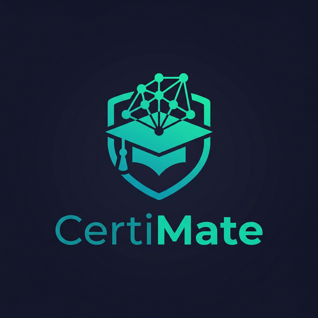
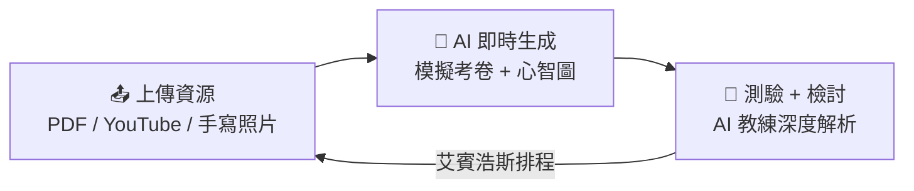
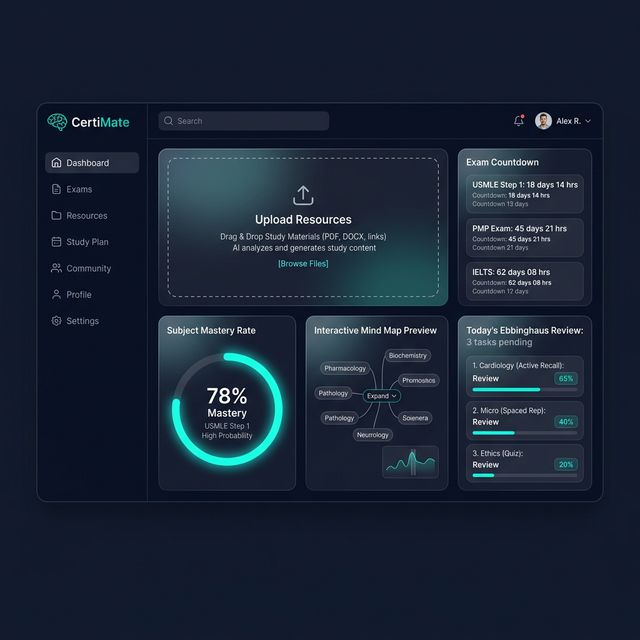
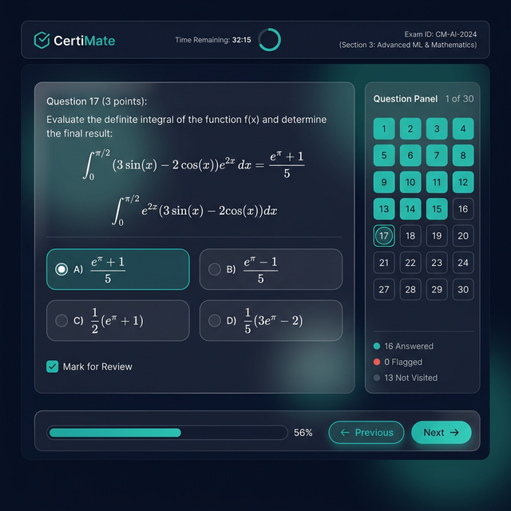
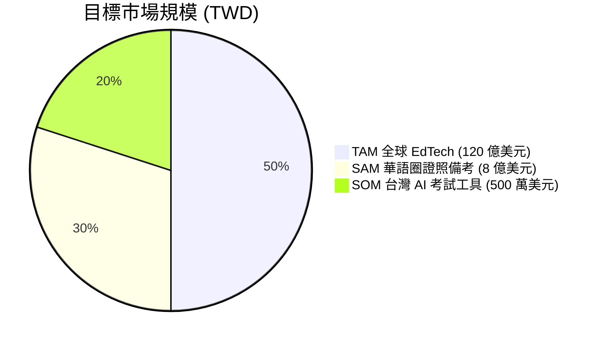
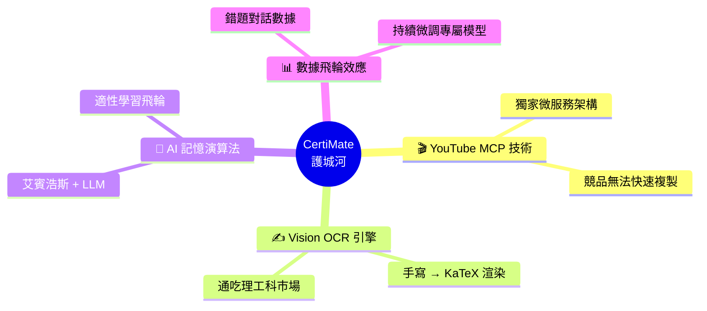
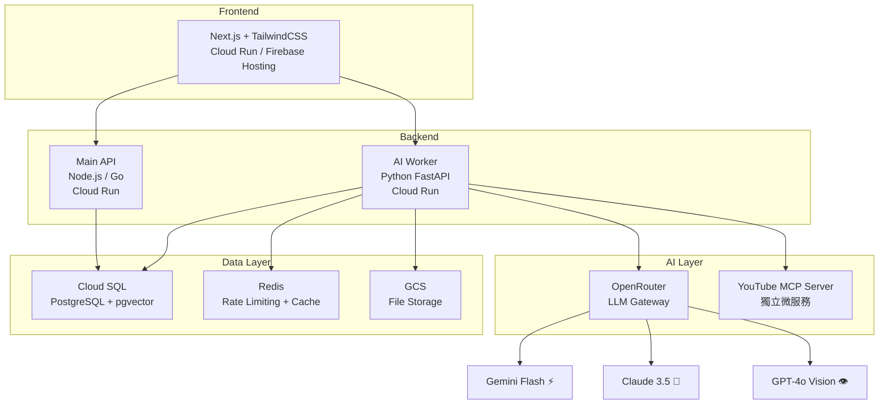
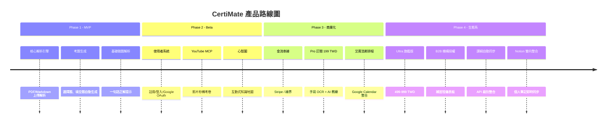
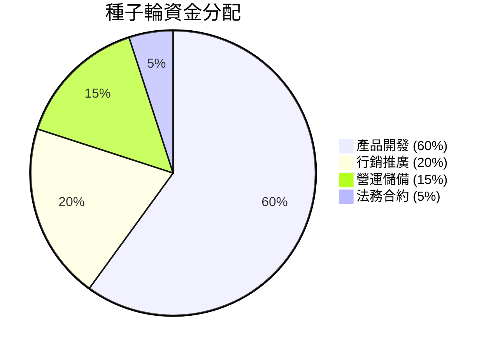

# CertiMate — 投資人簡報 (Pitch Deck)

> **AI 賦能的證照備考平台 ｜ 讓每個人都考得過**

---

## 📌 Slide 1：痛點 (The Problem)

### 考生的三大噩夢

| 😰 痛點 | 現狀 |
| :--- | :--- |
| **看完就忘** | 花 10 小時看完 YouTube 教學影片，隔天只記得 20% |
| **找不到題庫** | 新興證照 (AI 應用、雲端、ESG) 根本沒有現成的考古題可以刷 |
| **手寫筆記無法數位化** | 理工科的微積分、化學式等手寫內容，現有工具完全無法辨識 |

### 市場現況的致命缺口

```mermaid
graph LR
    A["📄 傳統題庫<br>(阿摩)"] -->|題目老舊<br>不支援新證照| GAP["❌ 巨大斷層"]
    B["🤖 通用 AI<br>(ChatGPT)"] -->|無測驗環境<br>幻覺風險高| GAP
    C["📓 文件 AI<br>(NotebookLM)"] -->|無錯題追蹤<br>無實戰壓迫感| GAP
    GAP -->|CertiMate| D["✅ 閉環備考<br>自動化特訓"]
```

---

## 🚀 Slide 2：解決方案 (The Solution)

### CertiMate = 你的「AI 專屬備考教練」

> 上傳任何學習資源，90 秒內自動生成擬真模擬考卷，並持續追蹤你的弱點進行個人化特訓。

**三步驟閉環體驗：**

### 核心亮點

| 功能 | 說明 |
| :--- | :--- |
| 🎬 **YouTube 秒轉考卷** | 貼上網址，10 小時的課程影片也能秒轉 50 題模擬考 |
| ✍️ **手寫數學 OCR** | 用 Vision AI 辨識潦草手寫筆記，以 KaTeX 完美渲染數學公式 |
| 🧠 **艾賓浩斯記憶排程** | 自動推播 Google Calendar 複習任務，告別「看完就忘」 |
| 📍 **考題溯源 (Citation)** | 每一題都標示出自講義哪一頁、影片哪一秒，錯哪裡就複習哪裡 |
| 🗺️ **AI 心智圖** | 一鍵生成互動式知識地圖，點擊節點即展開原文解析 |

---

## 📱 Slide 3：產品展示 (Product Demo)

### 儀表板 — 你的備考指揮中心

### 測驗介面 — 仿真機考環境 (Pearson VUE 等級)

---

## 📊 Slide 4：市場機會 (Market Opportunity)

### TAM / SAM / SOM

### 為什麼是「現在」？

| 驅動力 | 說明 |
| :--- | :--- |
| 🏛️ **證照市場爆發** | 雲端、AI、ESG 等新興證照每年更新，傳統題庫完全跟不上 |
| 📉 **AI 成本雪崩式下降** | Gemini Flash 的 Token 成本已降至 $0.075/百萬，讓 AI SaaS 首次具備正向毛利 |
| 📱 **YouTube 學習趨勢** | 68% 的學生使用 YouTube 作為主要學習管道，但缺乏「影片轉考卷」的工具 |
| 🧮 **理工科數位化缺口** | 市場上幾乎沒有工具能處理手寫數學公式的 OCR 與線上考卷渲染 |

---

## 🏆 Slide 5：競爭優勢 (Competitive Moat)

| 指標 | 阿摩 | Quizlet | ChatGPT | NotebookLM | **CertiMate** |
| :--- | :---: | :---: | :---: | :---: | :---: |
| YouTube 秒轉考卷 | ❌ | ❌ | ❌ | ❌ | ✅ |
| 手寫數學 OCR | ❌ | ❌ | ⚠️ | ❌ | ✅ |
| 標準化測驗 UI | ✅ | ⚠️ | ❌ | ❌ | ✅ |
| 錯題本 + 弱點追蹤 | ⚠️ | ❌ | ❌ | ❌ | ✅ |
| 艾賓浩斯排程 | ❌ | ❌ | ❌ | ❌ | ✅ |
| 考題原文溯源 | ❌ | ❌ | ❌ | ✅ | ✅ |
| 價格 (月) | 免費+廣告 | $35.99 USD | $20 USD | 免費 | **199 TWD** |

### 四重護城河

---

## 💰 Slide 6：商業模式 (Business Model)

### 定價策略：199 TWD/月 — 破壞性價格

| 方案 | 價格 | 定位 |
| :--- | :--- | :--- |
| 🆓 **Free** | $0 (含廣告) | 每月 3 份資源 + 3 回考卷，體驗 AI 威力 |
| 👑 **Pro** | **199 TWD/月** | 無限資源 + 無限考卷 + AI 教練 + 手寫 OCR |
| 🏢 **Ultra (Phase 4)** | 499~999 TWD/月 | B2B 機構授權 + 課綱自動同步 + Notion 整合 |

### 為什麼是 199 TWD？

> **「1 字頭」在台灣定價學上有著奇妙的魔力。**

- 💳 **衝動購物區間**：每天不到 7 元，比一杯超商咖啡還便宜
- 🛡️ **防禦性極強**：有資金的大廠看不上這點利潤，沒資金的新創因為沒有 Serverless 架構會直接虧本倒閉
- 📊 **一般用戶毛利 76%** (151 TWD)，極端重度用戶僅些微虧損 (-57 TWD)，整體現金流極度健康

---

## 📈 Slide 7：財務預估 (Unit Economics)

### 單位經濟模型

| 指標 | 數值 |
| :--- | :--- |
| 單份 50 頁講義 AI 處理成本 | **< $0.01 USD (0.3 TWD)** |
| 一般 Pro 用戶月均 API 成本 | **$1.5 USD (48 TWD)** |
| Pro 月費收入 | **199 TWD** |
| **一般用戶毛利率** | **76%** |
| 基礎設施月固定成本 (初期) | **500 ~ 1,000 TWD** |
| **損益兩平僅需** | **11 位 Pro 用戶** |

### 獲利情境模擬

| 里程碑               | Free 用戶 | Pro 用戶 (11% 轉換率) |     月營收      |     月成本      |     **月淨利**      |
| :---------------- | :-----: | :--------------: | :----------: | :----------: | :--------------: |
| Phase 1           |   100   |        11        |  2,189 TWD   |  ~2,000 TWD  |   **+189 TWD**   |
| Phase 2           |  1,000  |       110        |  21,890 TWD  |  ~8,000 TWD  | **+13,890 TWD**  |
| Phase 3           | 10,000  |      1,100       | 218,900 TWD  | ~50,000 TWD  | **+168,900 TWD** |
| **Phase 4 (B2B)** | 50,000  |  5,500 + 20 機構   | **1.3M TWD** | ~200,000 TWD |  **+1.1M TWD**   |

> ⚡ Phase 3 起，月營收即可突破 **20 萬 TWD**，年化 **240 萬 TWD**。
> 搭配 Phase 4 的 B2B 機構授權，年營收將進入 **千萬級別 (1,500 萬 TWD)**。

---

## 🏗️ Slide 8：技術架構 (Tech Stack)

### 全 Serverless 架構 — 縮容至 0 的成本優勢

### 關鍵技術決策

| 決策 | 理由 |
| :--- | :--- |
| **OpenRouter 作為 LLM Gateway** | 不綁定單一廠商，1ms 內可切換備援模型，確保 99.9% SLA |
| **MCP 插件式架構** | YouTube 解析器獨立部署，未來擴充 Podcast / Notion 只需新增 MCP Server |
| **Redis 快取 + doc_hash** | 同一份講義只解析一次，全體用戶共享快取，邊際成本趨近於零 |
| **Vision OCR Pipeline** | 手寫筆記 → GPT-4o Vision → KaTeX Markdown → 完美數學考卷 |

---

## 🗺️ Slide 9：產品路線圖 (Roadmap)

---

## 🤝 Slide 10：我們需要什麼 (The Ask)

### 尋找策略夥伴與天使投資

| 類型 | 我們需要的 | 我們提供的 |
| :--- | :--- | :--- |
| 💰 **天使投資人** | 種子輪資金 300 ~ 500 萬 TWD | 估值對價的股權 + 董事席位 |
| 🏫 **教育機構合作** | 封測用戶 + 真實課綱內容 | 免費導入 Ultra 方案 + 聯名品牌 |
| 🔧 **技術合夥人** | Full-stack / AI 工程師 | 共同創辦人 + 技術股 |
| 📢 **行銷/社群夥伴** | 學生社群觸及力 | 營收分潤 + 聯盟行銷計畫 |

### 資金用途規劃

---

## 💡 Slide 11：為什麼投資我們？

### 🎯 五大投資亮點

1. **📉 極低試錯成本**：全 Serverless 架構，零流量時月成本 < 一杯咖啡
2. **💰 極高毛利模型**：一般用戶毛利率 76%，11 位付費用戶即打平
3. **🛡️ 破壞性定價壁壘**：199 TWD 讓對手「進來也活不了」
4. **🚀 四重技術護城河**：YouTube MCP + Vision OCR + 記憶演算法 + 數據飛輪
5. **📈 清晰的 B2B 成長路徑**：Phase 4 直通補習班、企業內訓的千萬營收市場

> ### *「NotebookLM 幫你讀懂，CertiMate 幫你考過。」*

---

**CertiMate** — 讓 AI 成為每個考生的專屬備考教練。

📧 聯繫我們：[your-email@example.com]
🔗 產品 Demo：[Coming Soon]
